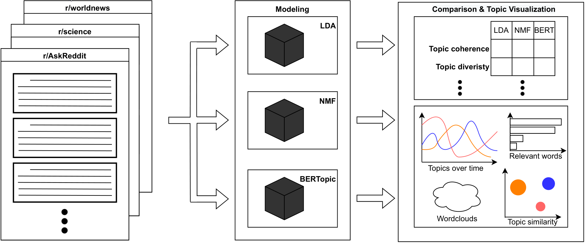

# Topic analysis performed on data from Reddit
*Authors: Maria Kędzierska, Marcelina Kurek, Mikołaj Spytek*

This repository contains the practical part of the Bachelor Thesis in the field of Data Science at the Faculty of Mathematics and Information Science, Warsaw University of Technology.

The files uploaded in the Diploma Theses Archive do not include, data, model and precached results. For this reason execution might be very slow. For testing it is recommended to download the repository with the cached files from [GitHub](https://github.com/kaluskam/topic-models-comparison).

Diagram describing the solution:

Installation instructions:

1. Download the project source code from the online repository available at [https://github.com/kaluskam/topic-models-comparison](https://github.com/kaluskam/topic-models-comparison) (either clone it using git, or download as a `.zip` file from the web browser and unzip it in a desired location).

2. Open a terminal and navigate to the downloaded folder. 
3. Ensure that the Python version 3.9.13 or newer is installed by typing `python --version` in the terminal and verifying the output of this command
4. Install all necessary dependencies by giving the command `pip install -r requirements.txt`
5. Launch the application by typing `python app.py`. On most systems, once the web server is up, the dashboard will open automatically in the browser. In case this does not happen, copy the address presented in the terminal (most likely `http://127.0.0.1:8050` if the port 8050 is not in use) and paste it into a web browser.
6. Try out the dashboard!
